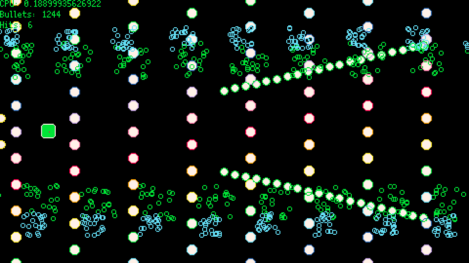
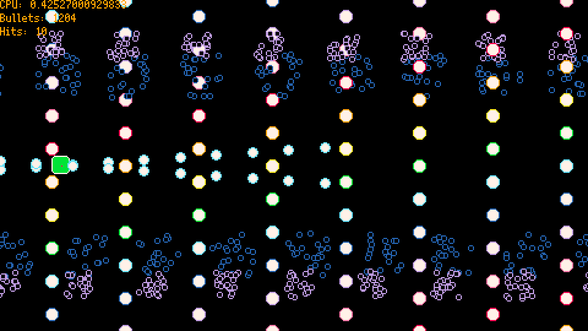
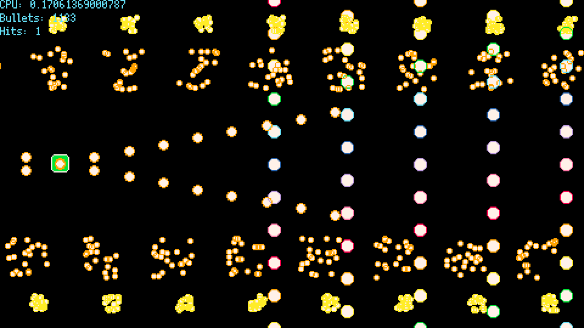
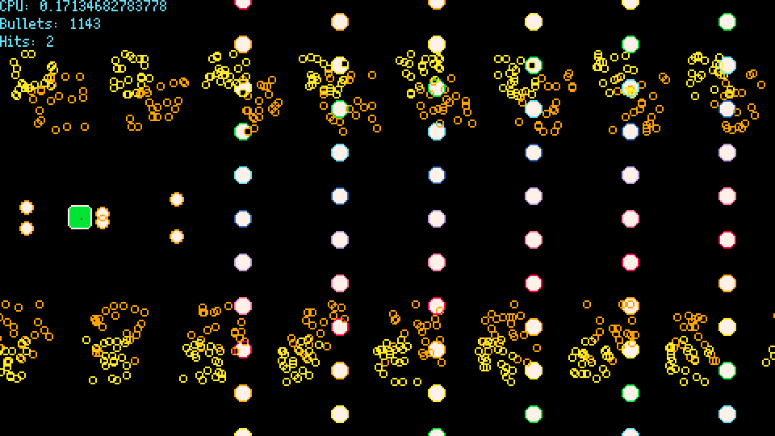

# Getting Started With Userdata

## Introduction

If you're building a complex game in Picotron, you may eventually run into performance issues.
The machine is powerful, but the virtual CPU has its limits!
If you need to get some extra power out of Picotron, one of the best tools to use is userdata.

Though powerful, userdata can be a bit confusing to use for beginners.
This guide aims to introduce userdata in an approachable way, with increasing complexity.
We will gloss over most programming details, so some programming knowledge is expected, but this is still designed to be beginner-friendly.

This guide will be based on a simple bullet hell demo.
In this game, a thousand bullets will fly at the player.
With so many bullets, a simple approach can eat up our entire CPU, so this gives userdata a chance to shine!



[The demo is playable on the BBS](https://www.lexaloffle.com/bbs/?tid=158363).

[The demo cart's source code is availible as well](https://github.com/yournameplease/picotron-demos/tree/main/intro_to_userdata/bullet_system_demo.p64).
The example code shared is slightly different for better readability, but the general design is the same.
Both a userdata and non-userdata bullet system are included, so you can experiment with both.

Also, be sure to check out the [wiki's userdata pages](https://github.com/Astralsparv/Picotron-Wiki/tree/main/picotron_api/userdata).
These will go into more depth than is covered in this guide.

## What is Userdata?

[Userdata](https://www.lexaloffle.com/dl/docs/picotron_manual.html#Userdata) is a fixed-size 1D or 2D array that can store numeric values.
Two features of userdata will be of great importance to our purposes:

1. Userdata allows for [batched arithmetic operations](https://www.lexaloffle.com/dl/docs/picotron_manual.html#Userdata_Operations).

> Operations on userdata cost 1 cycle for every 24 operations, except for mult (16 ops), div/mod (4 ops), pow (2 ops), and operations that do a compare (4), plus any overhead for the function call itself.

In simpler terms, if we want to do a lot of additions, and we can convert our data into userdata, we can get close to a 24x speedup!
The speedup is less for other operations, but it's still big.

2. Userdata allows for [batched graphics operations](https://www.lexaloffle.com/dl/docs/picotron_manual.html#Batch_GFX_Operations)

The speedup is less extreme here, but we can still get big savings.
If our data is formatted well, we can make all of our drawing calls at once, instead of drawing each object separately.

### 1D userdata

Say we have two input lists of numbers, `A` and `B`, each of the same length.
If we wanted to produce a new list `C`, where each element `C[i]` equal to `2*A[i] - B[i]`, how could we do that?

In Lua, our code might look something like this:

```lua
function combine_lists(in_a, in_b)
  local out = {}
  for i = 1,#in_a do
    out[i] = 2 * in_a[i] - in_b[i]
  end
  return out
end

local a = {4, 5, 6}
local b = {7, 8, 9}

local c = combine_lists(a, b)
-- c = {1, 2, 3}
```

This is not bad, but that for loop means this operation could take a long time if the list is long.  How would userdata handle this?

```lua
function combine_userdatas(in_a, in_b)
  return 2 * in_a - in_b
end


local a = userdata("f64", 3, 1, "4.0,5.0,6.0")
local b = userdata("f64", 3, 1, "7.0,8.0,9.0")

local c = combine_lists(a, b)
-- c = a userdata containing 1.0, 2.0, 3.0
```
 
Wow, we avoided the loop entirely!  Nice!

Well, the loop isn't actually gone, we've just moved it to batched operations.
Multiplication is batched at 16 operations per cycle, and subtraction at 24 per cycle, so we can expect this function to speed up by somewhere around 16x from our original.

#### Userdata access

The way we create and access userdatas differ as well.

To create a userdata, you call [`userdata(type, width, height, [data])`](https://github.com/Astralsparv/Picotron-Wiki/blob/main/picotron_api/functions/userdata/main.md).
Since we have a list of 3 numbers, we passed width as 3 and height as 1 for a 1D array.

We could also use [`userdata:set(x, val)`](https://github.com/Astralsparv/Picotron-Wiki/blob/main/picotron_api/userdata/methods/set/main.md) like so:

```lua
local a = userdata("f64", 3)
a:set(0, 4.0)
a:set(1, 5.0)
a:set(2, 6.0)
```

Or use use [`userdata:set(x, val0, val1, ...)`](https://github.com/Astralsparv/Picotron-Wiki/blob/main/picotron_api/userdata/methods/set/main.md) to set multiple values at once:

```lua
local a = userdata("f64", 3)
a:set(0,
  4.0, 5.0, 6.0
)
```

To read our values, we can use [`userdata:get(x)`](https://github.com/Astralsparv/Picotron-Wiki/blob/main/picotron_api/userdata/methods/get/main.md):

```lua
local a_0 = a:get(0) -- 4.0
local a_1 = a:get(1) -- 5.0
local a_2 = a:get(2) -- 7.0
```

Or use [`userdata:get(x, n)`](https://github.com/Astralsparv/Picotron-Wiki/blob/main/picotron_api/userdata/methods/get/main.md#userdatageti-count-) to read multiple values:

```lua
local a_0, a_1, a_2 = a:get(0, 3) -- 4.0, 5.0, 6.0
```

You may have noticed, userdatas count from 0 rather than 1, like with Lua tables.
0-indexed arrays are the standard in most languages other than Lua.

We can also use square brackets to access userdatas like a Lua table:

```lua
a[0] = 1 -- equivalent to a:set(0, 1)
?a[1] -- equivalent to ?a:get(1)
```

This is convenient for 1D userdata, but less so for 2D userdata, so I usually prefer using `get()` and `set()`.

## Our non-userdata baseline

Let's go over our non-userdata bullet system, so we know what we will be converting to userdata.

### The bullets

A bullet will look like this:

```lua
local bullet = {
  x = 10, -- x position
  y = 20, -- y position
  dx = 2, -- x speed per frame
  dy = 1, -- y speed per frame
  fric = .999, -- dx and dy multiply by fric each frame, allowing bullets to slow down
  r = 4, -- radius, both for collision and drawing
  c_inner = 7, -- color of the bullet's center 
  c_outer = 8, -- color of the bullet's edge
  t = 120, -- count down by 1 each frame.  at 0, despawn
}
```

We can store these bullets in a table and loop over them to update and draw.

```lua
function bullets_update(bullets)
  for _,b in ipairs(bullets) do
  		b.dx = b.dx * b.fric
  		b.dy = b.dy * b.fric
  		b.x = b.x + b.dx
  		b.y = b.y + b.dy
  		b.t = b.t - 1
  end

  -- delete bullets with t <= 0
  local i 
	while i <= #bullets do
    local b = bullets[i]
		if b.t <= 0 then
			deli(self.data, i)
		else
			i = i+1
		end
  end
end

function bullets_draw(bullets)
  for _,b in ipairs(bullets) do
		circfill(b.x, b.y, b.r, b.c_inner)
		circ(b.x, b.y, b.r, b.c_outer)
  end
end
```



## Converting to userdata

The table-based bullet system works, but we'd like some more performance.
Now's our time to try converting to userdata.

However, our simple example with 1D userdata doesn't give us the power we need yet.
It's time to learn about 2D userdata!

### 2D userdata

If we create a userdata with a height, we get a 2D userdata:

```lua
local ud = userdata("f64", 5, 3)
ud:set(1, 0, 1.0)
ud:set(1, 2,
  2.0, 3.0, 4.0
)
ud[13] = 5.0
```

gives us a userdata that looks like this:

|   |   |   |   |   |
|--:|--:|--:|--:|--:|
|0.0|1.0|0.0|0.0|0.0|
|0.0|2.0|3.0|4.0|0.0|
|0.0|0.0|0.0|5.0|0.0|

That square bracket example is a bit tricky.
We're treating the 2D array as a 1D array.
To help you visualize, each row starts at `y * ud:width()` and counts up:

|   |   |   |   |   |
|--:|--:|--:|--:|--:|
|  0|  1|  2|  3|  4|
|  5|  6|  7|  8|  9|
| 10| 11| 12| 13| 14|

Thus, `ud:get(x, y)` is the same as `ud[x + y * ud:width()]`.
For general use, the 2-coordinate approach is often enough,
but being able to use the 1D form will help with batch operations.


### Designing up our data

Our bullet right now is a table, but if we want to convert it to userdata, we need do think about how to fit it in a userdata's 2D array.
For our bullet system, we can have each bullet be a row of the data, and add a new row for each bullet:


|x|y|r|c|dx|dy|fric|t|c_inner|c_outer|
|--:|--:|--:|--:|--:|--:|--:|--:|--:|--:|
|10.0|20.0|5.0|0.0|2.0|1.0|0.999|120.0|7.0|8.0|
|30.0|40.0|5.0|0.0|2.0|-1.0|0.999|120.0|7.0|8.0|
|...|...|...|...|...|...|...|...|...|...|

Here we see two different bullets.
The `c` column is new, but it will help when we get to drawing.
All of the others columns are the same as in our original.

This is getting to be a pretty big table, so it's hard to keep track of which column is which.
It's a good idea to define some constants to use instead of raw indexes:

```lua
local X_COL = 0
local Y_COL = 1
local R_COL = 2
local C_COL = 3
local DX_COL = 4
local DY_COL = 5
local FRIC_COL = 6
local T_COL = 7
local C_INNER_COL = 8
local C_OUTER_COL = 9

local BULLETS_W = 12
```

This way, if you ever need to reorganize your columns, you can change the constant instead of searching through all of your indexes.

Unlike a table, userdata needs a fixed size at creation.  So we can define:

```lua
-- make it big enough to hold
-- as many bullets as you expect to have active at once
local MAX_BULLETS = 2048 
```

Picotron gives you a lot of memory to work with, so it's usually fine to allocate more than you need.
But you can keep the size smaller if you're concerned about memory.

Now let's create our userdata bullets list:

```lua
local bullets = userdata("f64", BULLETS_W, MAX_BULLETS)
local bullets_count = 0 -- how many bullets are active
```

Defining `bullets_count` will help us keep track of the number of active bullets.
If we keep our userdata contiguous (no gaps in rows),
the last bullet will be at the row with `y = bullets_count - 1`.

### Spawning bullets

To spawn a bullet, we can use [`userdata:set(x, y, val0, ...)`](https://github.com/Astralsparv/Picotron-Wiki/blob/main/picotron_api/userdata/methods/set/main.md#userdatasetcolumn-row-):

```lua
function spawn_bullet(b)
  if bullets_count >= MAX_BULLETS then
    -- too many bullets!  don't spawn
    return
  end

  bullets:set(X_COL, bullets_count, b.x)
  bullets:set(Y_COL, bullets_count, b.y)
  bullets:set(R_COL, bullets_count, b.r)
  bullets:set(C_COL, bullets_count, 0)
  bullets:set(DX_COL, bullets_count, b.dx)
  bullets:set(DY_COL, bullets_count, b.dy)
  bullets:set(FRIC_COL, bullets_count, b.fric)
  bullets:set(T_COL, bullets_count, b.t)
  bullets:set(C_INNER_COL, bullets_count, b.c_inner)
  bullets:set(C_OUTER_COL, bullets_count, b.c_outer)

  bullets_count = bullets_count + 1
end
```

Alternatively, we can use [`userdata:set(x, y, val0, ...)`](https://github.com/Astralsparv/Picotron-Wiki/blob/main/picotron_api/userdata/methods/set/main.md#userdatasetcolumn-row-), though this is a bit harder to read, and will need to update if we rearrange the columns:

```lua
function spawn_bullet(b)
  if bullets_count >= MAX_BULLETS then
    -- too many bullets!  don't spawn
    return
  end

  bullets:set(0, bullets_count,
    b.x,
    b.y,
    b.r,
    0,
    b.dx,
    b.dy,
    b.fric,
    b.t,
    b.c_inner,
    b.c_outer
  )

  bullets_count = bullets_count + 1
end
```

### Depawning bullets

To despawn a bullet, we can't just remove the bullet's row.
We need to remove any empty rows to keep the data contiguous.

We could do this by shifting all data forwards,
but the case of bullets has a simpler approach
Since we don't care about the order of the bullets,
we can simply copy the last bullet into the deleted bullet's row
and decrement the `bullets_count` mark the last row as no longer active.

So something like:
```lua
function despawn_bullet(i)
  bullets:set(X_COL, i, b.x, bullets:get(X_COL, bullets_count - 1))
  bullets:set(Y_COL, i, b.y, bullets:get(Y_COL, bullets_count - 1))
  -- and so on...

  bullets_count = bullets_count - 1
end
```

But this gets pretty long.
It's time to learn more about batch operations!

### Advanced batch operations

Earlier, we did arithmetic operations on userdata:

```lua
function combine_userdatas(in_a, in_b)
  return 2 * in_a - in_b
end
```

This is a batch operation -- it applies one operation to elementwise to two userdatas.
These batched operations work if we want to do one operation to the entire table,
but we often only want to operate on a part of the table.

The full function signature is described in [the documentation](https://www.lexaloffle.com/dl/docs/picotron_manual.html#Userdata_Operations):

```lua
userdata:op(src, dest, src_offset, dest_offset, len, src_stride, dest_stride, spans) 
```

`op` is any operation, such as
[`add`](https://github.com/Astralsparv/Picotron-Wiki/blob/main/picotron_api/userdata/methods/add/main.md),
[`mul`](https://github.com/Astralsparv/Picotron-Wiki/blob/main/picotron_api/userdata/methods/mul/main.md),
[`sub`](https://github.com/Astralsparv/Picotron-Wiki/blob/main/picotron_api/userdata/methods/sub/main.md),
[`div`](https://github.com/Astralsparv/Picotron-Wiki/blob/main/picotron_api/userdata/methods/div/main.md), and
[`pow`](https://github.com/Astralsparv/Picotron-Wiki/blob/main/picotron_api/userdata/methods/pow/main.md), to name a few.

We'll refer to the userdata being operated on as LHS (left hand side).

Let's start by converting our simple example to use this form:

```lua
function combine_userdatas(in_a, in_b)
  return in_a:mul(2):sub(in_b)
end
```

So here, we take LHS `in_a`,
multiply by 2 to create a new LHS,
and then add `in_b` to create our final return value.

`src` can be either a userdata or a number (also called a scalar).

`dest` lets us send the result to an existing userdata, instead of creating a new one as the result.
For example:

```lua
local a = userdata("f64", 3, 1, "1,2,3")
local b = userdata("f64", 3, 1, "4,5,6")
local c = userdata("f64", 3) -- uninitialized, so it starts as 0, 0, 0

-- sets the contents of c[i] equal to the result of a[i] + b[i]
a:add(b, c)
```

We can also pass `dest` as `true` to store the result into the LHS:

```lua
local a = userdata("f64", 3, 1, "1,2,3")
local b = userdata("f64", 3, 1, "4,5,6")

-- sets the contents of a[i] equal to the result of a[i] + b[i]
a:add(b, true) -- same as a:add(b, a)
```

We can even pass `src` as the LHS:

```lua
local a = userdata("f64", 3, 1, "1,2,3")

-- sets the contents of a[i] equal to the result of a[i] + a[i]
-- (or in other words, 2 * a[i])
a:add(a, true)
```

The remaining parameters unlock more power.

With offsets, we can start the batch operations at different cells:

- `src_offset` indicates where to start when reading from `src`
- `dest_offset` indicates where to start for both reading from LHS and writing to `dest`

```lua

local a = userdata("f64", 5, 1, "1,2,3,4,5")
local b = userdata("f64", 5, 1, "6,7,8,9,10")

-- starting from i = 1, c[i] will equal to a[i] + b[i + 1]
local c = a:add(b, nil, 1, 2)
-- c = (0, 2+8, 3+9, 4+10, 5+0)
-- c = (0, 10, 12, 14, 5)
```

`len`, `src_stride`, `dest_stride`, and `spans` let us operate on non-contiguous blocks of userdata:

- `len` is the number of elements in a group
- `src_stride` is the difference between the starting element of two groups from `src`
- `dest_stride` is the difference between the starting element of two groups from `dest` (and LHS)
- `spans` is the number of groups

```lua
local a = userdata("f64", 10, 1, "0,1,2,3,4,5,6,7,8,9")

local c = a:add(a, nil,
  0, -- src_offset
  1, -- dest_offset
  2, -- len
  3, -- src_stride
  4, -- dest_stride
  2 -- spans
)
-- c = (0 + 1, 1 + 2, 0, 3 + 5, 4 + 6, 0, 6 + 9, 7 + 0, 0, 0, 0)
-- c = (1, 3, 0, 8, 10, 0, 15, 7, 0, 0, 0)
```

### Depawning bullets, with batch operations!

We can use these batch operations to simplify our despawn logic.
To despawn a bullet, we need to copy a row (of width `BULLETS_W`),
from `y = bullets_count-1` to `y = i`.

We can use the userdata `:copy()`, which is a unary operator (ignoring LHS)
equivalent to `userdata.add(0, src)`:

```lua
function despawn_bullet(i)

  bullets:copy(
    bullets, -- copy from bullets
    true, -- write to self
    (bullets_count - 1) * BULLETS_W, -- copy from y = bullets_count - 1
    (i) * BULLETS_W -- to y = i
    BULLETS_W, -- copy the full row
    0, -- src_stride unused for spans = 1
    0, -- dest_stride unused for spans = 1
    1, -- only one row to copy
  )

  bullets_count = bullets_count - 1
end
```

`:copy()`, being a batch operation, is cheaper than setting each value separately,
so you will generally want to use `:copy()` if moving data within/between userdatas.

### Bullet logic, userdata version

We can use the same batch operations to convert our `bullets_update` and `bullets_draw` loops into single calls.

Since we want to do the same operation to each row of the data, we will use a `span` of `bullets_count` and a `len` of 1.

```lua
bullets:add(
  bullets, -- add t
  true, -- write to self
  DX_COL, -- add bullets[DX_COL]
  X_COL, -- to bullets[X_COL]
  1, -- just the one column
  BULLETS_W, -- jump forward by one row for the next addition (src_stride)
  BULLETS_W, -- jump forward by one row for the next addition (dest_stride)
  bullets_count -- repeat for all bullets_count active rows
)
```

This adds the value of `bullets:get(i, DX_COL)` to `bullets:get(i, X_COL)` for each `i = 0, bullets_count - 1`. 

Now we can convert our full update:

```lua
function bullets_update(bullets)
  bullets:mul(bullets, true, FRIC_COL, DX_COL, 1, BULLETS_W, BULLETS_W, bullets_count)
  bullets:mul(bullets, true, FRIC_COL, DY_COL, 1, BULLETS_W, BULLETS_W, bullets_count)
  -- len = 2.  Since x,y and dx,dy are contiguous, we can group both operations together.
  bullets:add(bullets, true, DX_COL, X_COL, 2, BULLETS_W, BULLETS_W, bullets_count)
  bullets:sub(1, true, 0, T_COL, 1, 0, BULLETS_W, bullets_count)

  -- delete bullets with t <= 0
  local i = 0
	while i < #bullets do
		if bullets:get(T_COL, i) <= 0 then
		  bullets:copy(bullets, true, (bullets_count - 1) * BULLETS_W, i * BULLETS_W, BULLETS_W, 0, 0, 1)
		else
			i = i+1
		end
  end
end
```

Nice!  The code looks a bit longer due to all the new parameters,
but really, we just replaced the for loop of a sequence of arithmetic operations
with a sequence of the same arithmetic operations, as userdata batch operations.

## Drawing userdata

Now it's time to draw our bullets!
This is where [batch GFX (graphics) operations](https://www.lexaloffle.com/dl/docs/picotron_manual.html#Batch_GFX_Operations) come in.

`pset`, `circ`, `circfill`, `rectfill`, `line`, `tline3d`, `spr`, and `sspr` can all be called via batch userdata operations.
To do this, the userdata must be a `f64` userdata, which is why we made our bullets an `f64`.
Usually, you'll want `f64`s anyways if you're doing something physics-based, but be warned that nothing will draw if you use other types!

By default, the drawing operations will use the full width of the userdata and perform the draw for each row:

```lua
-- example from picotron manual
args = userdata("f64", 4, 3)
args:set(0,0,
  100,150,5,12, -- blue circle
  200,150,5,8,  -- red cricle
  300,150,5,9)  -- orange circle
circfill(args)
```

We can use the additional arguments to change this to account for a differently shaped userdata:

`gfx_func(p, offset, num, num_params, stride)`

```lua
args = userdata("f64", 4, 3)
args:set(0,0,
  100,150,5,12, -- blue circle
  200,150,5,8,  -- red cricle
  300,150,5,9)  -- orange circle
circfill(args,
  1, -- offset, start reading arguments at index 1 (0, 1) 
  2, -- num, only make 2 circfill draws
  3, -- num_params, only take 3 arguments.  Since color is not proveded, all colors will be 
  5, -- stride.  after each draw, jump forward by 5 elements (so, draw 2 will start at index 6 (1, 2))
)

-- this is equivalent to:
-- circfill(150, 5, 12)
-- circfill(5, 8, 300)
```

Of course, we don't need to do things so complicated.
Our data has one bullet per row we can keep `num_params` at 4 (max for `circ`/`circfill`) and keep stride at `BULLETS_W`.

```lua
function bullets_draw()
  -- copy the inner color to the color column
  bullets:copy(bullets, true, C_INNER_COL, C_COL, 1, BULLETS_W, BULLETS_W, bullets_count)
  -- draw the inner circles
	circfill(bullets,
    X_COL, -- start reading arguments at X_COL
    bullets_count, -- draw all of the bullets
    4, -- 4 argements: X_COL, Y_COL, R_COL, C_COL
    BULLETS_W -- one draw per row
  )
  -- copy the outer color to the color column
  bullets:copy(bullets, true, C_OUTER_COL, C_COL, 1, BULLETS_W, BULLETS_W, bullets_count)
  -- draw the outline
	circ(bullets, X_COL, bullets_count, 4, BULLETS_W)
end
```

Nice!

Copying these colors is a bit annoying, but we can't change the order of the parameters, so it's a necessary evil.

If your bullets are only one color, you could skip the extra column,
and just store your color in C_COL to avoid the copy dance.

There's also a subtle difference between our drawing steps.
With the table of bullets, we looped the bullets,
and for each bullet, draw the inner color followed by the outer color rim.

With userdata, we are first drawing all inner circles, and then all outer circles.
So two bullets overlapping will look a bit off:



For me, this is a price I can pay, and it can still look pretty cool with a transparent `c_inner`:



If you care about the clipping, you could use `spr` with prerendered sprites instead of making multiple draw calls.

### What else?

I'm leaving collision-detection out of the tutorial, but it's present in the source code, so check it out if you're interested.
There are tricks to let you batch the collision a bit, but I think it's more readable to just loop over it.

### When to use userdata

While powerful, userdata is not always so simple to convert to.
With this approach, userdata is best used when your data consists of many distinct objects
consisting of numeric fields which are updated independently.

If you need non-numeric data, such as strings or tables, you can use userdata for your numeric data,
but have an additional table, keyed by row id, to store the non-numeric data.

"Updated independently" is important to keep in mind as well.
If you are making a particle simulation where each particle checks collision with each other,
this will require you to do some logic for every pair of rows in your data.
While not impossible with userdata, the number of operations grows quickly here,
so userdata may not give as much performance gain as you would hope.
