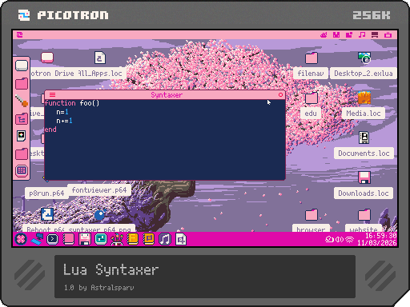

# tokenoid(line,pos,[token_state]): str, pos1, category, new_token_state

## Overview

`tokenoid` returns the tokenisation of a string in lua into 6 categories: spaces, regular text, numbers, comments, strings and operators.

## Arguments

### `line`: string

The line of lua code to process.

### `pos`: number

The character index of the line to process from

### `[token_state]`: unknown|nil

The previous token state; used to support things such as multi-line strings and multi-line comments.

## Returns

### `str`: string

The string being the lua token that was processed, e.g: `apple` in `function apple()`.

### `pos1`: number

The starting position of the next token.

When `pos` is more than the length of `line`, it is the end of the last token extracted.

### `category`: number

The category of the token, these are as follows:

0. Space
1. Regular text
2. Number
3. Comment
4. String
5. Operators

### `new_token_state`: unknown

The new token state, used for multi-line comments and strings.

## Examples

A simple Lua syntaxer.

This can be seen in the example lua syntaxer cart found on the [bbs](https://www.lexaloffle.com/bbs/?tid=155528).

The png file can be downloaded from here 

```lua
local syntaxes={
	[0]="7", --space
	[1]="7", --regular text
	[2]="c", --number
	[3]="d", --comment
	[4]="c", --string
	[5]="7" --operator
}

function syntax_line(line,token_state)
	local pos=1
	local out=""
	while pos<=#line do
		--use tokenoid to handle main syntax
		local str,pos1,cat,new_state=tokenoid(line,pos,token_state)
		if (not str) break
		
		local col=syntaxes[cat] or 7
		
		--now do strings like "function", "end", "then", "break", etcetc
		
		if (cat==1) then
			if (
				str=="function" or str=="end" or str=="return"
				or str=="local"
				
				or str=="for" or str=="while"
				or str=="in" or str=="do"
				or str=="if" or str=="break" or str=="then" or str=="else"
				or str=="or"
				) then
				col="e"
			end
		end
		out..="\f"..col..str
		
		pos=pos1
		token_state=new_state
	end
	
	return out,token_state
end

function syntax(text)
	text=text:split("\n")
	local res=""
	local l,token_state="",nil
	for i,line in ipairs(text) do
		l,token_state=syntax_line(line,token_state)
		res..=l.."\n"
	end
	return res
end

txt=[[n=1
function foo()
	n+=1
end

foo()
print(n)]]

print(syntax(txt))
```

This can be paired with the api functions to create a full lua syntaxer for picotron.

```lua
local syntaxes={
	[0]="7", --space
	[1]="7", --regular text
	[2]="c", --number
	[3]="d", --comment
	[4]="c", --string
	[5]="7" --operator
}

function syntax_line(line,token_state)
	local pos=1
	local out=""
	while pos<=#line do
		--use tokenoid to handle main syntax
		local str,pos1,cat,new_state=tokenoid(line,pos,token_state)
		if (not str) break
		
		local col=syntaxes[cat] or 7
		
		--now do strings like "function", "end", "then", "break", etcetc
		
		if (cat==1) then
			if (
				str=="function" or str=="end" or str=="return"
				or str=="local"
				
				or str=="for" or str=="while"
				or str=="in" or str=="do"
				or str=="if" or str=="break" or str=="then" or str=="else"
				or str=="or"
				) then
				col="e"
			else
				local api={
					flr=1,pset=1,select=1,set_spr=1,vec=1,set=1,map=1,reset=1,palt=1,userdata=1,poke8=1,get_spr=1,
					get=1,cp=1,socket=1,foreach=1,t=1,create_process=1,pal=1,sspr=1,tokenoid=1,fillp=1,
					memset=1,norm=1,btn=1,assert=1,type=1,oval=1,create_undo_stack=1,error=1,poke2=1,
					theme=1,add=1,env=1,fetch_metadata=1,clear_key=1,pwf=1,menuitem=1,load=1,create_gui=1,
					on_event=1,sfx=1,mv=1,store=1,tonum=1,mouselock=1,pwd=1,music=1,print=1,memmap=1,store_metadata=1,
					tostring=1,time=1,pod=1,include=1,rect=1,date=1,stat=1,get_clipboard=1,peektext=1,split=1,
					pairs=1,unpod=1,readtext=1,key=1,getmetatable=1,camera=1,keyp=1,sgn=1,fset=1,mouse=1,tostr=1,
					notify=1,all=1,sub=1,rawlen=1,ord=1,mset=1,yield=1,pack=1,costatus=1,cocreate=1,min=1,ceil=1,
					rawequal=1,unmap=1,coresume=1,stop=1,peek2=1,unpack=1,printh=1,exit=1,memcpy=1,note=1,window=1,
					line=1,get_display=1,cursor=1,get_draw_target=1,open=1,pget=1,del=1,mid=1,spr=1,ipairs=1,
					vid=1,rawset=1,peek4=1,poke=1,deli=1,peek=1,btnp=1,pid=1,tonumber=1,circfill=1,rrectfill=1,
					max=1,set_draw_target=1,cd=1,mget=1,cls=1,mount=1,poke4=1,color=1,blit=1,fstat=1,atan2=1,
					collectgarbage=1,ls=1,setmetatable=1,rm=1,send_message=1,count=1,mkdir=1,create_delta=1,
					cos=1,rawget=1,circ=1,clip=1,flip=1,next=1,peek8=1,fetch=1,wrangle_working_file=1,tline3d=1,
					rectfill=1,srand=1,set_clipboard=1,fget=1,sqrt=1,warn=1,pcall=1,fullpath=1,chr=1,apply_delta=1,
					rnd=1,ovalfill=1,abs=1,sin=1,rrect=1,["goto"]=1
				}
				if (api[str]) col="b"
			end
		end
		out..="\f"..col..str
		
		pos=pos1
		token_state=new_state
	end
	
	return out,token_state
end

function syntax(text)
	text=text:split("\n")
	local res=""
	local l,token_state="",nil
	for i,line in ipairs(text) do
		l,token_state=syntax_line(line,token_state)
		res..=l.."\n"
	end
	return res
end

txt=[[n=1
function foo()
	n+=1
end

foo()
print(n)]]

print(syntax(txt))
```